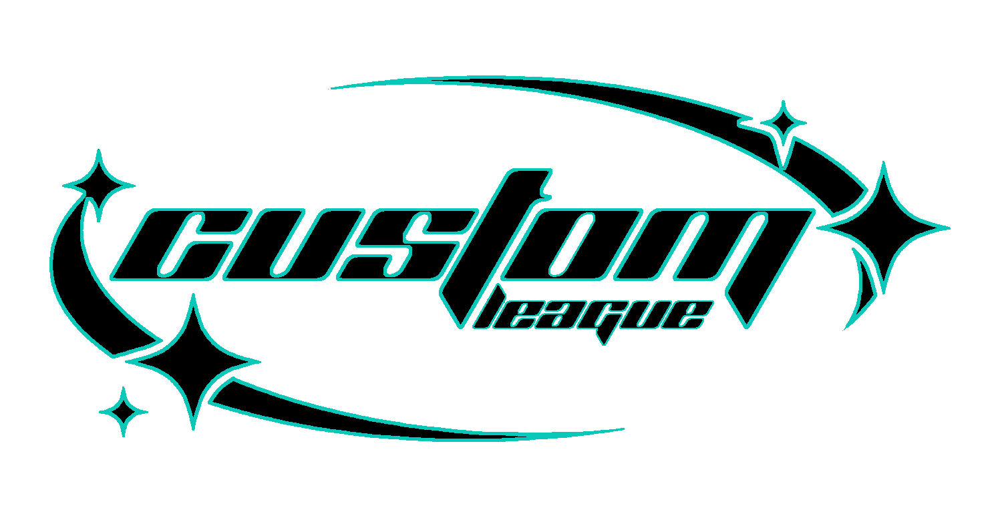

# 
Custom League

 A league custom creator 

> <a href="https://github.com/swojtczak/Praktyki-2022-05/pulls"> Report a 🐛</a> <

## About The Project :mag:

This project is a Solution to a problem me and my friends had while playing custom games in League of Legends. ...

## Build with🏗️

* ![js]
* ![php]
* ![sql]
* ![html]
* ![css]
* ![pi]

[js]: https://img.shields.io/badge/js-yellow

[php]: https://img.shields.io/badge/php-darkblue

[sql]: https://img.shields.io/badge/sql-blueviolet

[html]: https://img.shields.io/badge/HTML-red

[css]: https://img.shields.io/badge/CSS-yellow

[pi]: https://img.shields.io/badge/RarsberryPI-lightgrey

## Usage :book:

### Admin:

Open website
* Send link to firends
* frends type there nick
* Admin goes into admin panel and randomises players
* After the game Admin selects whitch team won on the admin panel

## Roadmap 🗺️

- [x] Add Players
- [x] Randomize Players 
- [x] Calculate winrate
- [x] Admin Panel
- [ ] More than one lobby at  a time 
- [ ] Expantion

## Core contributors 👥
* [Keped](https://github.com/Kepedoc)
* [Kasjanoboss](https://github.com/KasjanoBoss)
